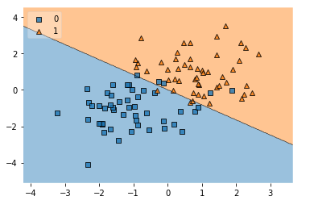
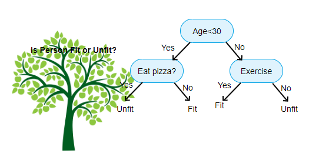
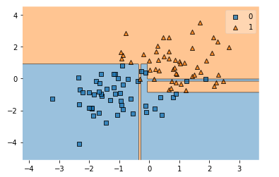
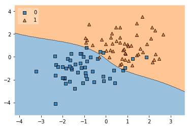
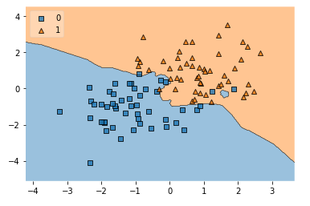
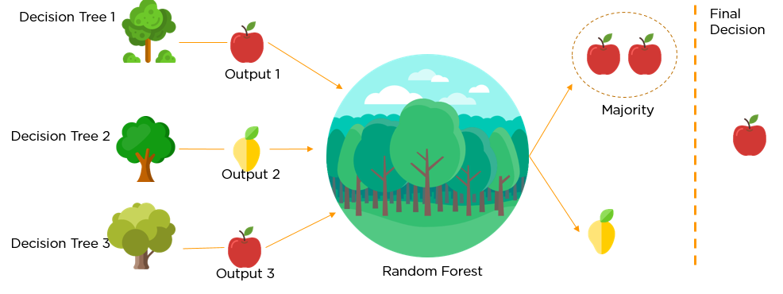
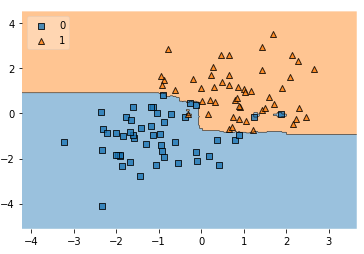
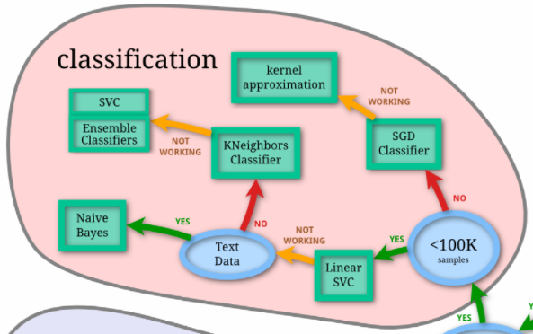

# demo_ml_model

### Logistic regression

Regression is one of the simplest, but most versatile, models available! In this specific instance we're using _logistic_ regression to draw a line in our data which will act as a boundary.

For this example we will not be creating training/test sets to test our results — we're just visually inspecting how well our out-of-the-box model is drawing boundaries.

```python 
lr = LogisticRegression(random_state=7007)
lr.fit(X, y)

# plotting
plot_decision_regions(X, y, clf=lr, legend=2)
```



Not too bad! We're seeing that a line down the middle of our chart does a pretty decent job at splitting our data. Some overlap does exist, where we see some blue squares in orange triangle territory, but that's okay — they're friends (for now...).

Let's see if another model can do a better job.

### Decision trees

Decision trees may be a term you've heard of before. This is a series of `if` statements that will perform a series of logic checks to determine how a certain data point should be labelled. 

Here's an example of a decision tree we may choose to follow to lead a healthy lifestyle (this is a trick question — the answer to eating pizza is 'yes' 100% of the time) 



```python
dt = DecisionTreeClassifier()
dt.fit(X, y)

# plotting
plot_decision_regions(X, y, clf=dt)
```



Very interesting! We have a little less overlap this time around, but as a result we see that it's created two separate lines that veer into the other colour's territory. Does anyone foresee an issue with this model as we add more data?

> **OVERFITTING:** Here we begin to see a case of overfitting beginning to occur. The term 'overfitting' implies that we have a model that is fit too much to our training set. As we introduce new data to our model, we may see our evaluation metrics plummet as the model is not a good estimator of the data in general, but just a good estimator of what's in the training set.

### Support-vector machines (SVMs)

SVMs draw a straight line (or flat plane or hyperplane) through points to decide which classes points belong to. But a straight line is fairly limiting. How do we overcome this problem? SVMs classify low-dimensional data in a powerful way, by embedding this low-dimensional data into higher dimensional space. These extra dimensions give the SVM extra ways to see 'differences' across points in different classes that would otherwise look very similar. What does this look like? See the following figure, where there is a clear boundary between classes of points, but one that cannot be drawn as a straight line. However, if we embed the points into three-dimensional space, we can draw a flat plane that effectively separates the points. We might worry about what that decision boundary would look like in lower dimensions, but the SVM handles this for us. 


Oftentimes, the data is embedded into spaces with thousands of dimensions. This means that learning a decision boundary is a computationally intensive task — or rather, it would be, if we didn't have something called the _kernel trick_. Put simply, the kernel trick is a way for us to do computations in the high-dimensional space, using only the data in the low-dimensional space — saving us loads of computation time! More details about the kernel trick can be found [here](https://en.wikipedia.org/wiki/Kernel_method#Mathematics:_the_kernel_trick) (it's a popular interview question for data science positions!).

```python
svm = SVC()
svm.fit(X, y)

# plotting
plot_decision_regions(X, y, clf=svm, legend=2)
```



As we can tell, there is still some overlap occurring. However we have now circumvented the issue of overfitting as we had seen in our decision tree. This does not fully imply that the model is perfect by any means, as we may start to see _underfitting_ taking place. Underfitting is the opposite of overfitting, in that our model's borders are not conformed enough.

### k-nearest neighbors (kNN)

[kNN](https://en.wikipedia.org/wiki/K-nearest_neighbors_algorithm) can be utilized for both regression and classification, but its premise consists of a type of voting process of a data points' neighbours. Depending on the majority around it, that will become the new classification for that data point. It's kind of like everyone in your group getting one pizza to share. If the majority of people like pineapple on their pizza, that is most likely what will end up getting purchased. 

```python
knn = KNeighborsClassifier(n_neighbors=3)
knn.fit(X, y) 

# plotting
plot_decision_regions(X, y, clf=knn, legend=2)
```



Even better! Looks like a democratic approach works quite well for this dataset. We see a little bit of confusion from kNN as a little blue blob has formed in the orange region. But otherwise it appears we've gotten a pretty good result here.

### Random forests

Random forests are one of the more computationally heavy classifiers. They utilize a multitude of decision trees to create boundaries. Decision trees on their own are prone to many mistakes, but a bunch of weak decision trees put together to make a forest is much more effective. This process in machine learning is called _ensembling_.

> **ENSEMBLING:** The process of combining multiple learning models to reach better predictive performance than a model could achieve on its own. Where one model falls short, another can pick up the shortcomings in its predictions to improve results. Not just any combination of models can be ensembled. They have to be carefully chosen so that each model focuses on a 'different enough' part of the data. 

The random forest algorithm uses the principle of ensembling to combine decision trees and make a final decision on how a certain point should be classified.



When fitting our model, we have one additional parameter we will include that involves how many 'estimators' we want to include. This is the amount of decision trees we want our model to base its decision off of.

```python
# setting 100 estimators
rf = RandomForestClassifier(n_estimators=100,  random_state=1337)
rf.fit(X, y)

# plotting
plot_decision_regions(X, y, clf=rf, legend=2)
```


To further improve the performance of our random forest model, we may opt to change the amount of estimators we use. Please note that depending on the amount of data you're using to model, this might become a very heavy task for your computer to handle. You may be forced to use a lower number of estimators, which could result in either underfitting or overfitting, similar to what we had seen with our decision tree example.

### Other models

There are a few other algorithms out there that can be utilized to create predictions. If you're interested in exploring other algorithms check out [this page](https://scikit-learn.org/stable/supervised_learning.html).


